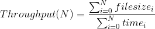
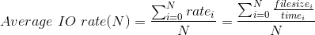

TestDFSIO
=========

Overview
--------

TestDFSIO is the canonical example of a benchmark that attempts to measure the HDFS's capacity for reading and
writing bulk data. It is also helpful to discover performance network bottlenecks in your network and to stress the
hardware, OS and Spark/Hadoop setup of your cluster machines. The test can measure the time taken to create a given
number of large files, and then use those same files as inputs to a test to measure the read performance an HDFS
instance can sustain.

The original version is included in the Hadoop's MapReduce job client library. However, since we could run the tests
on a Spark Standalone cluster, we need to use a modified version of this benchmark based entirely on Spark and fully
compatible with the Alluxio filesystem.

Getting started
---------------

### How it works

The TestDFSIO benchmark is used for measuring I/O (read/write) performance and it does this by using Spark jobs to read
and write files in parallel. It intentionally avoids any overhead or optimizations induced by Spark and therefore, it
assumes certain initial requirements. For instance, files should be replicated and spread to nodes relatively evenly. As
a result, if it runs at least one map task per node on the cluster, it will write out data evenly assuring correct locality.

The test consists of two phases: *write* and *read*. The *read* phase does not generate its own files. For this reason,
it is a convenient practice to first run a *write* test and then follow-up with a *read* test, while using the same
parameters as during the previous run. TestDFSIO is designed in such a way that it will use 1 map task per file, i.e.
it is a 1:1 mapping from files to map tasks. Splits are defined so that each map gets only one filename, which it
creates or reads.

In the *write* phase, firstly, the test creates a specific number of control files with the name and the file size of
the resulting files the test will write subsequently. It then reads the control files and writes random data in each
file, up to the size indicated, while collecting metrics for each task. In the *read* phase, the control files are read
again, and the data written to the files are read sequentially using a ring buffer.

Each of the phases is executed in a different Spark job, so their execution requires multiple jobs to be deployed in an
orderly fashion.


### How to submit the benchmark

In order to launch the benchmark on a cluster, you can use the `spark-submit` script in Spark's `bin` directory. Once the
benchmark is bundled, you can launch, for instance, the *write* test just typing the following script:

```
$SPARK_HOME/bin/spark-submit \
  --master <master-url> \
  --class com.bbva.spark.benchmarks.dfsio.TestDFSIO \
  --total-executor-cores <total-executor-cores> \
  --executor-cores <executor-cores> \
  --driver-memory 1g \
  --executor-memory 1g \
  --conf spark.locality.wait=30s \
  ... # other options
  /path/to/spark-benchmarks/dfsio/target/scala-2.11/spark-benchmarks-dfsio-0.1.0-with-dependencies.jar \
  write --numFiles 10 --fileSize 1GB --outputDir hdfs://<hdfs-namenode>:8020/benchmarks/DFSIO
```

This test will run the corresponding *write* test using 10 input files of size 1GB.

The TestDFSIO benchmark writes its files to /benchmarks/DFSIO on HDFS. Files from older write runs are overwritten.
If you want to preserve the output files of previous runs, you have to copy these files manually to a new HDFS
location. Benchmark results are appended to a local file called `TestDFSIO_results.log` in the current local directory
and also printed to log. If you want to save them to different filename, set the `-resFile` option appropriately.

The benchmark accepts different arguments passed to the main method of the main class. You can use the option `--help`
to print the different combinations:

```
$SPARK_HOME/bin/spark-submit \
  --master local \
  --class com.bbva.spark.benchmarks.dfsio.TestDFSIO \
  /path/to/spark-benchmarks/dfsio/target/scala-2.11/spark-benchmarks-dfsio-0.1.0-with-dependencies.jar \
  --help
```

Which prints the following help text:

```
Test DFS I/O 0.1.0
Usage: TestDFSIO [write|read|clean] [options]

Command: write [options]
Runs a test writing to the cluster. The written files are located in the DFS under the folder
defined by the option <outputDir>. If the folder already exists, it will be first deleted.

  --numFiles <value>       Number of files to write. Default to 4.
  --fileSize <value>       Size of each file to write (B|KB|MB|GB). Default to 1MB.
  --outputDir <file>       Name of the directory to place the resultant files. Default to /benchmarks/DFSIO
  --resFile <fileName>     Name of the local file in the current local directory where to append the benchmark results.
  --bufferSize <value>     Size of each file to write (B|KB|MB|GB). Default to 1MB.
  --hadoopProps k1=v1,k2=v2...
                           Extra hadoop configuration properties
Command: read [options]
Runs a test reading from the cluster. It is convenient to run test with command write first, so that some
files are prepared for read test. If the test is run with this command before it is run with command write,
an error message will be shown up.

  --numFiles <value>       Number of files to read. Default to 4.
  --fileSize <value>       Size of each file to read (B|KB|MB|GB). Default to 128B.
  --inputDir <file>        Name of the directory where to find the files to read. Default to /benchmarks/DFSIO
  --resFile <fileName>     Name of the local file in the current local directory where to append the benchmark results.
  --bufferSize <value>     Size of each file to write (B|KB|MB|GB). Default to 1MB.
  --hadoopProps k1=v1,k2=v2...
                           Extra hadoop configuration properties
Command: clean [options]
Remove previous test data. This command deletes de output directory.
  --outputDir <file>       Name of the directory to clean. Default to /benchmarks/DFSIO
  --help                   prints this usage text
  --version

```

Following the previous instructions, the *read* test should be launched like this:

```
$SPARK_HOME/bin/spark-submit \
  --master <master-url> \
  --class com.bbva.spark.benchmarks.dfsio.TestDFSIO \
  --total-executor-cores <total-executor-cores> \
  --executor-cores <executor-cores> \
  --driver-memory 1g \
  --executor-memory 1g \
  --conf spark.locality.wait=30s \
  ... # other options
  /path/to/spark-benchmarks/dfsio/target/scala-2.11/spark-benchmarks-dfsio-0.1.0-with-dependencies.jar \
  read --numFiles 10 --fileSize 1GB --inputDir hdfs://<hdfs-namenode>:8020/benchmarks/DFSIO
```

Note that each time the *write* phase is executed, the benchmark data is previously cleaned up. However, if you need to force
the deletion at any moment, you can use the *clean* command:

```
$SPARK_HOME/bin/spark-submit \
  --master <master-url> \
  --class com.bbva.spark.benchmarks.dfsio.TestDFSIO \
  ... # other options
  /path/to/spark-benchmarks/dfsio/target/scala-2.11/spark-benchmarks-dfsio-0.1.0-with-dependencies.jar \
  clean --outputDir hdfs://<hdfs-namenode>:8020/benchmarks/DFSIO
```

For more information about submitting applications, please, refer to the
[Spark's documentation](https://spark.apache.org/docs/latest/submitting-applications.html).

### Interpreting the results

Now, let's have a look at how the benchmark shows the resulting performance statistics.

Here follows an example of a result log after a write test and a subsequent read test have been run:

```
----- TestDFSIO ----- : write
           Date & time: Mon May 08 2017
       Number of files: 1000
Total MBytes processed: 1000000
     Throughput mb/sec: 4.989
Average IO rate mb/sec: 5.185
 IO rate std deviation: 0.960
    Test exec time sec: 1113.53

----- TestDFSIO ----- : read
           Date & time: Mon May 08 2017
       Number of files: 1000
Total MBytes processed: 1000000
     Throughput mb/sec: 11.349
Average IO rate mb/sec: 22.341
 IO rate std deviation: 119.231
    Test exec time sec: 544.842
```

The most significant metrics are  *Throughput mb/sec* and *Average IO rate mb/sec*. Both of them are based on the file size
written or read by every individual task and the elapsed time to do so. Therefore, it excludes the scheduling time of the tasks
from the calculations.

Having this in mind, the *Throughput* metric for the whole job, where *N* is the number of tasks, is defined as follows:

<p align="center">
  
</p>

The *Average IO rate* is defined as:

<p align="center">
  
</p>
